# KnowzCode Visual Guide

*Your visual roadmap to understanding the KnowzCode ecosystem.*

This guide illustrates the file structure and workflow of a KnowzCode project, showing how all components work together to create a systematic development environment.

Navigate with confidence through every file, folder, and workflow in a KnowzCode project.

---

### How KnowzCode Components Work Together

```mermaid
graph TD
    subgraph "Your Input"
        User[You: Provide Goals & Decisions]
        EnvContext[knowzcode/environment_context.md<br/>You Configure This]
    end

    subgraph "Core System Files"
        Project[knowzcode/knowzcode_project.md<br/>Vision & Standards]
        Architecture[knowzcode/knowzcode_architecture.md<br/>System Blueprint]
        Tracker[knowzcode/knowzcode_tracker.md<br/>Progress Dashboard]
        Loop[knowzcode/knowzcode_loop.md<br/>AI Instructions]
        Log[knowzcode/knowzcode_log.md<br/>History & Memory]
    end

    subgraph "Generated During Development"
        Specs[knowzcode/specs/*.md<br/>Component Blueprints]
        Planning[knowzcode/planning/*.md<br/>Feature Analysis]
        Code[Your Code<br/>The Actual App]
    end

    subgraph "Workflow Tools"
        Prompts[knowzcode/prompts/<br/>KCv2.0__Spec_Verification_Checkpoint.md<br/>KCv2.0__[LOOP_2B]__Verify_Implementation.md]
    end

    %% User interactions
    User -->|Provides PrimaryGoal| Loop
    User -->|Fills out| EnvContext
    User -->|Uses| Prompts

    %% How Loop uses other files
    Loop -->|Reads context from| Project
    Loop -->|Updates status in| Tracker
    Loop -->|Logs actions to| Log
    Loop -->|Follows map in| Architecture
    Loop -->|Uses commands from| EnvContext

    %% What gets created
    Loop -->|Creates/Updates| Specs
    Loop -->|Writes| Code
    Prompts -->|Generates| Planning

    %% Dependencies
    Architecture -->|Defines all| Specs
    Tracker -->|Tracks status of| Specs
    Specs -->|Blueprint for| Code

    style User fill:#4CAF50,color:#fff
    style EnvContext fill:#4CAF50,color:#fff
    style Code fill:#FF5252,color:#fff
    style Loop fill:#FF9800,color:#fff
    style Project fill:#2196F3,color:#fff
    style Architecture fill:#2196F3,color:#fff
    style Tracker fill:#2196F3,color:#fff
    style Log fill:#2196F3,color:#fff
    style Specs fill:#9C27B0,color:#fff
    style Planning fill:#9C27B0,color:#fff
    style Prompts fill:#607D8B,color:#fff
```

---

### At a Glance

KnowzCode transforms chaotic AI development into a systematic, maintainable process through a carefully orchestrated file system. This guide is your architectural blueprint—showing you exactly what lives where and why it matters.

---

### Core Architecture Overview

| Path | Description |
| :--- | :--- |
| 📁 `knowzcode/` | ← The System's Core Documents |
| ├── `knowzcode_project.md` | The Project's Constitution & Vision |
| ├── `knowzcode_architecture.md` | The Visual System Blueprint |
| ├── `knowzcode_tracker.md` | The Live Progress Dashboard |
| ├── `knowzcode_loop.md` | The AI Agent's Operational Manual |
| └── `knowzcode_log.md` | The Project's Immutable History |
| ├── `environment_context.md` | ← The Agent's Tactical "Driver" |
| ├── `specs/` | ← The Blueprint Library for Components |
| │   └── `[NodeID].md` | Individual Component Contracts |
| ├── `planning/` | ← Strategic & Brainstorming Artifacts |
| ├── `workgroups/` | ← Live WorkGroup todo queues (each entry begins `KnowzCode:`) |
| │   └── `feature_breakdown_...md`| Feature Analysis Reports |
| └── `prompts/` | ← The Orchestrator's Command Toolkit |
|     └── `ND__*.md` | Workflow & Loop Templates |

---

### The Core Documents: `knowzcode/`

The brain of your operation—five essential files that orchestrate strategy.

**`knowzcode/knowzcode_project.md`** - The Project Constitution
*   **Purpose:** Defines the project's DNA: its vision, goals, tech stack, and coding standards.

**`knowzcode/knowzcode_architecture.md`** - The Visual Blueprint
*   **Purpose:** An interactive system flowchart showing all components (`NodeID`s) and their connections.

**`knowzcode/knowzcode_tracker.md`** - The Live Dashboard
*   **Purpose:** Provides real-time progress monitoring of all nodes.
*   **Key Columns:** `Status`, `WorkGroupID` (for active work), `Dependencies`.

**`knowzcode/knowzcode_loop.md`** - The AI's Playbook
*   **Purpose:** The AI agent's primary instruction manual, detailing the step-by-step development process.

**`knowzcode/knowzcode_log.md`** - The Project's Memory
*   **Purpose:** A complete, chronological history of all significant decisions, actions, and outcomes.

---

### The Core Files: `knowzcode/`

**`knowzcode/environment_context.md`** - The Tactical "Driver"
*   **Purpose:** Translates the abstract goals from `knowzcode/knowzcode_loop.md` into concrete, platform-specific commands.
*   **Your Role:** You, the user, must fill this file out to tell the agent *how* to operate in your specific environment (e.g., how to run tests, commit code, etc.). **The system cannot function without it.**

**`knowzcode/specs`** - The Blueprint Library
*   **Purpose:** Contains detailed blueprints (`[NodeID].md`) for every single component in the system. Each spec is a contract that is drafted before building and finalized to an "as-built" state after verification.

**`knowzcode/planning`** - The Strategy Room
*   **Purpose:** A directory to store strategic planning documents generated by prompts like `knowzcode/prompts/ND__Feature_Idea_Breakdown.md`. These artifacts help shape the roadmap before work officially begins.

---

### The KnowzCode Lifecycle

This diagram shows the updated, verification-driven lifecycle.

*(Note: This is a textual representation of the workflow. The visual diagram may not be updated.)*

```mermaid
graph LR
    Start([Start Work Session]) --> Goal{Provide<br/>PrimaryGoal}
    Goal --> L1A[LOOP 1A<br/>Propose Change Set]
    L1A --> Review1{Review<br/>Change Set}
    Review1 -->|Approved| L1B[LOOP 1B<br/>Draft Specs]
    L1B --> Review2{Review<br/>Specs}
    Review2 -->|Approved| Gate1{Spec<br/>Verification<br/>Checkpoint?};
    Gate1 --> |Yes| VerifySpecs[Verify Specs] --> L2A;
    Gate1 --> |No| L2A;
    L1B --> L2A[LOOP 2A<br/>Implement]
    L2A --> L2B[LOOP 2B<br/>Audit]
    L2B --> Review3{Review<br/>Audit}
    Review3 --> |Approved| L3[LOOP 3<br/>Finalize & Commit]
    Review3 --> |Rejected| L2A
    L3 --> Complete([Feature Complete])
    Complete --> Start

    style Start fill:#4CAF50,color:#fff
    style Complete fill:#4CAF50,color:#fff
    style Goal fill:#FF9800,color:#fff
    style Review1 fill:#FF9800,color:#fff
    style Review2 fill:#FF9800,color:#fff
    style Review3 fill:#FF9800,color:#fff
    style Gate1 fill:#E91E63,color:#fff
    style L1A fill:#2196F3,color:#fff
    style L1B fill:#2196F3,color:#fff
    style L2A fill:#2196F3,color:#fff
    style L2B fill:#2196F3,color:#fff
    style L3 fill:#2196F3,color:#fff
```



**Phase 1: Genesis (New Project)**
1.  **Prepare your vision** → Create blueprint, project overview, and architecture
2.  **Build initial prototype** → AI creates the first version
3.  **`knowzcode/prompts/KCv2.0__Install_And_Reconcile.md`** → Install KnowzCode and reconcile with actual build

**Phase 2: Development (The Loop)**
1.  **`knowzcode/prompts/KCv2.0__Start_Work_Session.md`** → Agent syncs up and is ready for a `PrimaryGoal`.
2.  **You provide a `PrimaryGoal`**.
3.  **The Verification-Driven Loop Begins:**
    *   `knowzcode/prompts/[LOOP_1A] Propose Change Set`
    *   `knowzcode/prompts/[LOOP_1B] Draft Specs`
    *   (Optional) `knowzcode/prompts/Spec_Verification_Checkpoint`
    *   `knowzcode/prompts/[LOOP_2A] Implement Change Set`
    *   (Mandatory) `knowzcode/prompts/[LOOP_2B] Verify Implementation`
    *   `knowzcode/prompts/[LOOP_3] Finalize & Commit`
4.  Repeat for the next `PrimaryGoal`.

---

### Quick Navigation Guide

| I want to... | Look at... |
| :--- | :--- |
| Understand the project's vision | `knowzcode/knowzcode_project.md` |
| See the big picture | `knowzcode/knowzcode_architecture.md`|
| Check project progress | `knowzcode/knowzcode_tracker.md` |
| Find a component's details | `knowzcode/specs/[NodeID].md` |
| Review project history | `knowzcode/knowzcode_log.md` |
| Know how the agent works | `knowzcode/knowzcode_loop.md` |
| See how to run commands | `knowzcode/environment_context.md` |
| Plan future features | `knowzcode/planning/` directory |

---

### File Creation and Ownership

**Human-Created Files:**
- `knowzcode/environment_context.md` - Must be filled out for each development environment

**KnowzCode-Generated Initial Files:**
- All files in `knowzcode/` directory
- Empty `knowzcode/specs/` and `knowzcode/planning/` directories

**Files Generated During Development:**
- `knowzcode/specs/[NodeID].md` - Created as components are designed
- `knowzcode/planning/feature_breakdown_*.md` - Created during planning sessions
- Application source code - Created by AI following the KnowzCode process

---

The KnowzCode system separates strategy (`knowzcode/` files) from tactics (`environment_context.md`), creating a powerful, portable, and professional framework for AI-driven development.
